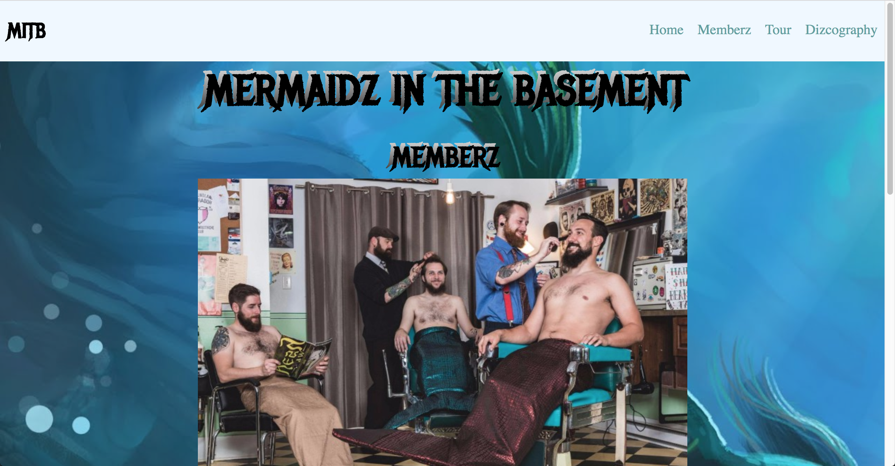
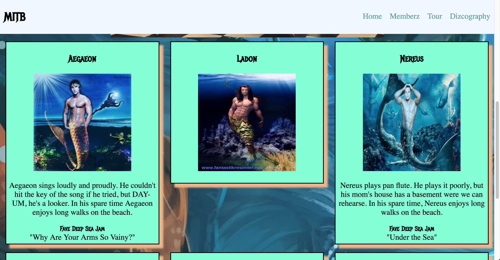
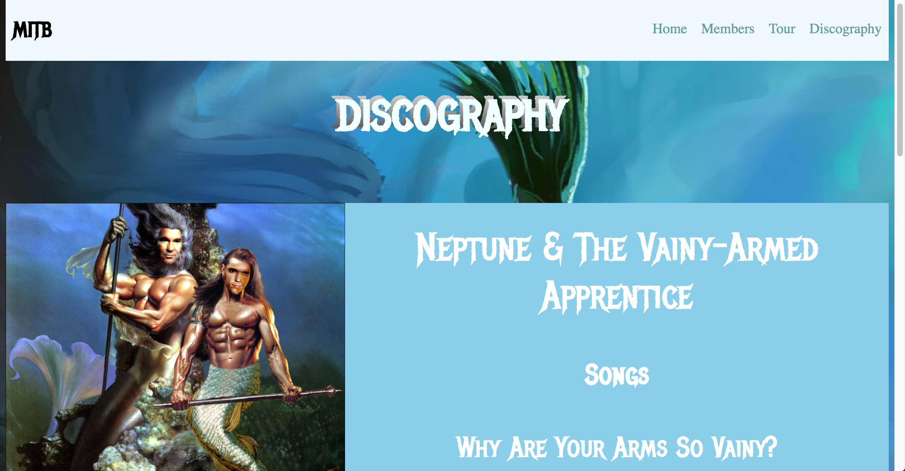
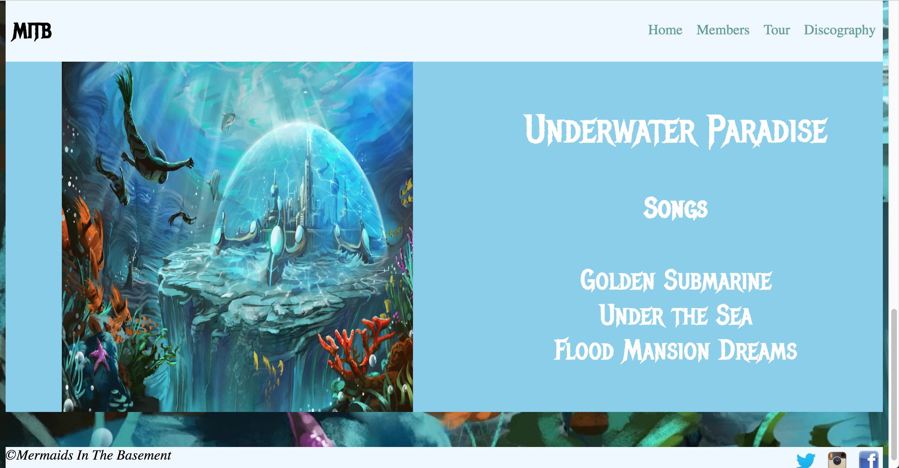

# bandz-mermaids-in-the-basement

This was a group work exercise to get familiar with git procedure in a team setting.

It also gave us the opportunity to put to use the coding skills we've acquired in the first 4 weeks of class.

The exercise was to build a band webpage with each team member responsible for one of the pages.

## Screenshots

​
​
​
​
​
​


## How to run this project:

* Use nmp to install htpp-server:

```sh

npm install -g http-server

```
* Run the server:

```sh

hs -p 9999

```

* Open Chrome and navigate to:

```

localhost:9999

```
